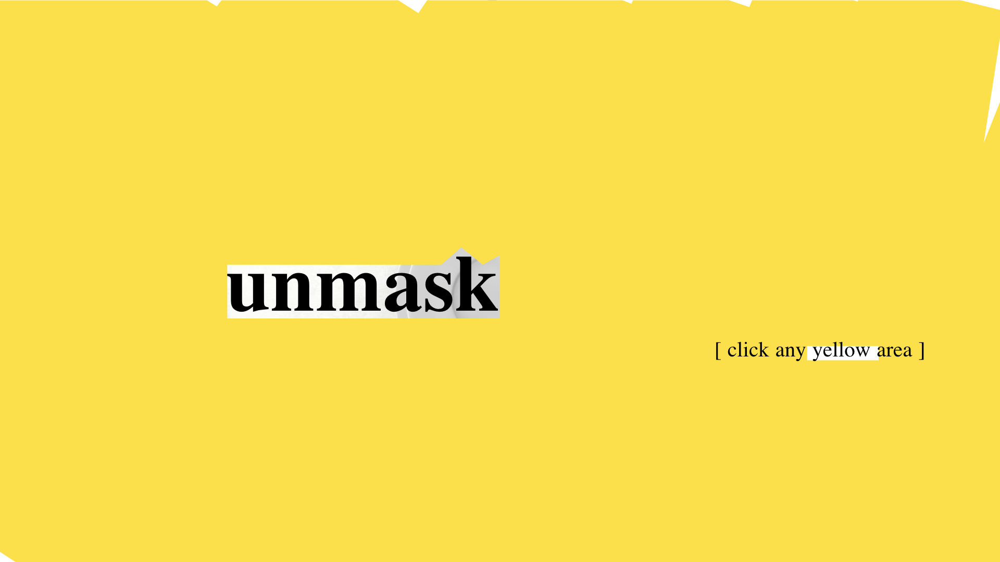

## Unmasking Masks  
### Uncovering global attitudes towards masks
##### Parsons School of Design MS Data Visualization Thesis '2020
###### Zui Chen
-------------
##### Masks have recently become common objects in our daily life and triggered world-wide arguments due to COVID-19.  There is a clear difference in attitudes between east Asian countries and the western world. How the difference derives and how the attitudes towards masks have changed globally become an interesting topic to explore.

Do you wear a mask when you go out in public? Now you will probably say yes, but what about a few months ago? Coronavirus has triggered a broad debate worldwide on masks. Through this project, I would like to discuss the global attitudes towards the mask and the rationale behind it.

Here is an analysis of the global online news coverage over the past three years related to "mask."  It is clear to see how the focus on "masks" has tremendously increased over the past few months. If we look at some of the hills, we can see the topics around mask change over time. So, 2017, 2018, 2019, and now it is all about mask usage for Covid-19.

The global attitudes towards the mask are really different between western countries and East Asian.  One of the most impactful factors is laws and policies.  In these years, governments in certain regions passed some legislation on mask prohibitions. The earliest one dated back to 18  century in the United Kingdom and is called The Black Act.  About a century later, New York passed the first anti-mask law in the US. Since the late 20th century, 15 countries and regions have ever passed prohibitions against mask-wearing in public space. These laws all result from concerns about public safety because masks can easily disable individual identification. Also, all these anti-mask laws were in western countries except the one in Hong Kong last year.

What about pro mask policies? During the 2002 SARS and 2009 H1N1 pandemic, there were only health organization recommendations on wearing masks for specific groups such as health care workers. While during the current Covid-19 epidemic, so far, there have been 98 countries and regions requiring masks in public and 34 recommending masks. Since the start of the pandemic, in East Asian, China has a general recommendation with local compulsory requirements, resulting in universal mask usage. Yet in South Korea and Japan, there is no requirement, masks have also been universally used. In early February, hate crimes against masking wearing Asians occurred in many western countries. Mask was, at that time, racialized and discriminated against. However, about two months later,
many western countries started to shift to a "pro-mask" attitude in such a pandemic time period.

Mask culture has spread over east Asian after SARS, mainly Japan, China, and South Korea, and it becomes a norm for people to wear masks in public on a daily base. People wear it for a variety of reasons besides staying away from diseases, for instance, to stay away from dust or pollution, to keep warm, or as a social firewall to prevent interaction with strangers or a fashion statement. However, in the western world, the mask has still long been stigmatized and associated with diseases or danger. Recently, we can see that Covid-19 is bringing the two closer. The mask culture common in Asian is so new and different to the west that it does trigger conflicts. As more conservation starts, it will be helpful to learn about why the difference occurs. I hope my project can assist with a better understanding of the difference and help us learn from each other.
